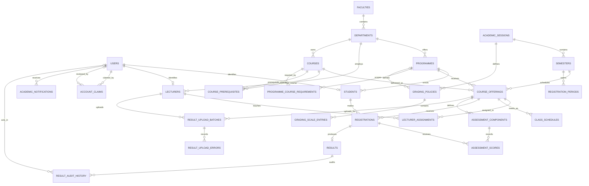

# Relationships

This ERD reflects the 27 application tables in the PostgreSQL schema. The Prisma migration ledger (`_prisma_migrations`) is deliberately excluded.

```mermaid
erDiagram
  USERS ||--o| STUDENTS : identifies
  USERS ||--o| LECTURERS : identifies
  USERS ||--o{ ACCOUNT_CLAIMS : claimed_by
  USERS o|--o{ ACCOUNT_CLAIMS : reviewed_by
  USERS ||--o{ ACADEMIC_NOTIFICATIONS : receives
  USERS o|--o{ RESULT_AUDIT_HISTORY : acts_in
  FACULTIES ||--o{ DEPARTMENTS : contains
  DEPARTMENTS ||--o{ PROGRAMMES : offers
  DEPARTMENTS ||--o{ LECTURERS : employs
  DEPARTMENTS ||--o{ COURSES : owns
  PROGRAMMES ||--o{ STUDENTS : enrols
  PROGRAMMES ||--o{ COURSE_OFFERINGS : receives
  PROGRAMMES ||--o{ PROGRAMME_COURSE_REQUIREMENTS : defines
  PROGRAMMES o|--o{ GRADING_POLICIES : scopes
  ACADEMIC_SESSIONS ||--o{ SEMESTERS : contains
  ACADEMIC_SESSIONS ||--o{ GRADING_POLICIES : defines
  SEMESTERS ||--o{ COURSE_OFFERINGS : schedules
  SEMESTERS ||--o{ REGISTRATION_PERIODS : opens
  COURSES ||--o{ COURSE_OFFERINGS : delivered_as
  COURSES ||--o{ COURSE_PREREQUISITES : dependent_course
  COURSES ||--o{ COURSE_PREREQUISITES : prerequisite_course
  COURSES ||--o{ PROGRAMME_COURSE_REQUIREMENTS : required_by
  COURSE_OFFERINGS ||--o{ LECTURER_ASSIGNMENTS : assigned_to
  COURSE_OFFERINGS ||--o{ CLASS_SCHEDULES : meets_as
  COURSE_OFFERINGS ||--o{ REGISTRATIONS : receives
  COURSE_OFFERINGS ||--o{ ASSESSMENT_COMPONENTS : defines
  COURSE_OFFERINGS ||--o{ RESULT_UPLOAD_BATCHES : uploads_for
  LECTURERS ||--o{ LECTURER_ASSIGNMENTS : teaches
  LECTURERS ||--o{ RESULT_UPLOAD_BATCHES : uploads
  STUDENTS ||--o{ REGISTRATIONS : makes
  REGISTRATIONS ||--o{ ASSESSMENT_SCORES : receives
  ASSESSMENT_COMPONENTS ||--o{ ASSESSMENT_SCORES : records
  REGISTRATIONS ||--o| RESULTS : produces
  RESULTS ||--o{ RESULT_AUDIT_HISTORY : audits
  GRADING_POLICIES ||--o{ GRADING_SCALE_ENTRIES : contains
  RESULT_UPLOAD_BATCHES ||--o{ RESULT_UPLOAD_ERRORS : records
```
